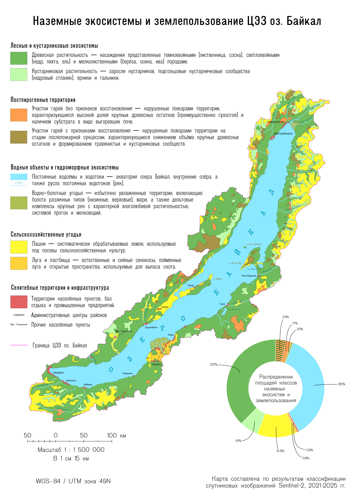
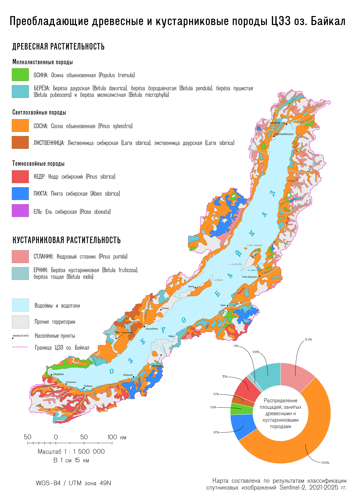

```{=html}
<p style="font-size: 16.5px;text-align: justify;">
<span style="font-weight: bold; color: #666666;">Кратко. </span>В рамках дипломного проекта была разработана методика автоматизированного картографирования и составлена серия карт, отражающих постпирогенное состояние лесных экосистем Центральной экологической зоны (ЦЭЗ) озера Байкал после катастрофических пожаров 2015 года.
</p>
```
---
```{=html}
<div style="font-size: 16.5px; text-align: justify; line-height: 1.55;">
    <p>
        Леса ЦЭЗ озера Байкал играют важнейшую роль в поддержании природного баланса региона. Однако в последние десятилетия они подверглись значительному воздействию, пиком которого стали разрушительные пожары 2015 года. Для анализа процессов восстановления растительности в условиях сложного горного рельефа требовалось создание актуальных материалов, так как существующие карты во многом базировались на устаревших данных.
    </p>

    <p>
        В ходе исследования была применена двухэтапная иерархическая классификация с использованием алгоритма машинного обучения Random Forest. Обработка мультиспектральных снимков Sentinel-2 и цифровой модели поверхности AW3D30 производилась с помощью облачной платформы Google Earth Engine и скриптов на языке Python. Оптимизация обработки высокодетальных растров на обширную территорию была достигнута за счет технологии оконного чтения.
    </p>

    <p>
        Результатом работы стали две взаимосвязанные карты масштаба 1:1 500 000: первая локализует гари и описывает общую структуру поверхности, вторая — детализирует преобладающие породы на лесопокрытых территориях.
    </p>
</div>
```

::: {.panel-tabset}

## Наземные экосистемы и землепользование

{fig-align="center"}

```{=html}
<div style="text-align: center; margin-top: 15px; margin-bottom: 20px;">
  <a href="../files/Map_ecosystems.pdf" target="_blank" style="display: inline-block; padding: 10px 20px; background-color: #f8f9fa; color: #333; text-decoration: none; border-radius: 5px; border: 1px solid #ccc; font-weight: bold; transition: 0.3s;">
    📄 Скачать карту экосистем (PDF)
  </a>
</div>
```

## Преобладающие породы

{fig-align="center"}

```{=html}
<div style="text-align: center; margin-top: 15px; margin-bottom: 20px;">
  <a href="../files/Map_species.pdf" target="_blank" style="display: inline-block; padding: 10px 20px; background-color: #f8f9fa; color: #333; text-decoration: none; border-radius: 5px; border: 1px solid #ccc; font-weight: bold; transition: 0.3s;">
    📄 Скачать карту экосистем (PDF)
  </a>
</div>
```
